# Trabajo Practico 1 - Felipe Cañas

## 1. Instalar Git

1.En mi caso ya lo tengo instalado:

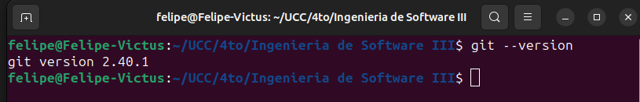

## 2. Crear un repositorio local y agregar archivos

1. Crear un repositorio local:

```
mkdir Ing-Soft-3
cd Ing-Soft-3
git init
```

 2.Agregar un archivo README.md con contenido:
```
echo "# Mi Proyecto" > README.md
```

 3.Hacer un commit:
```
git add .
git commit -m "Archivo Readme agregado"
```

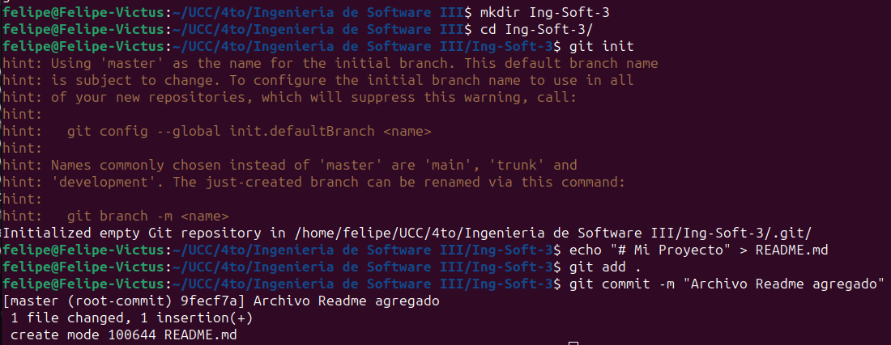

## 3. Configuración del Editor Predeterminado

 1.Configurar VSC como editor predeterminado:
```
git config --global core.editor "code --wait"
```

## 4. Creación de Repos 01 -> Crearlo en GitHub, clonarlo localmente y subir cambios

 1. Cuenta de Github: https://github.com/felipecanias

 2. Crear repositorio desde Github.

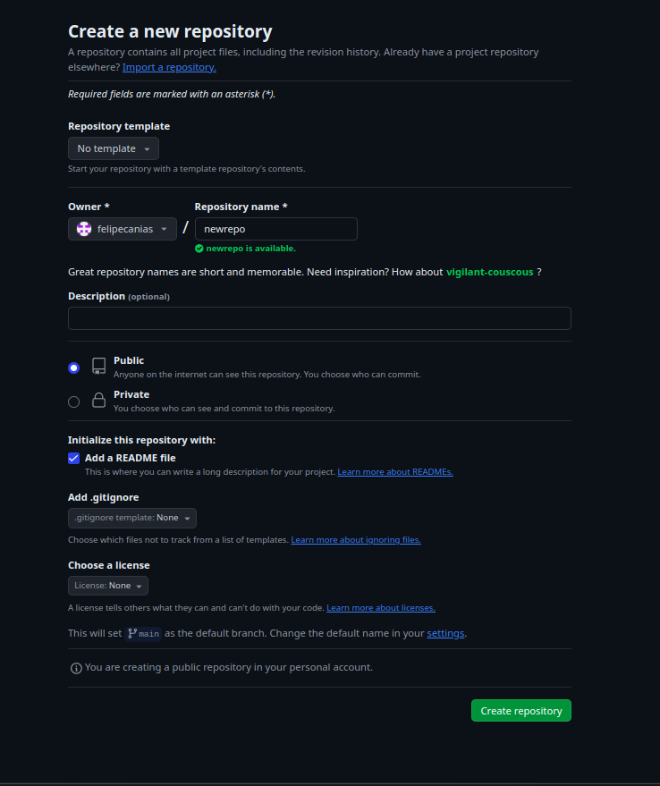

 3.Clonar el repositorio remoto:
```
git clone https://github.com/felipecanias/newrepo.git
cd newrepo
```

 4.Editar el archivo README.md:
```
echo "Informacion" >> README.md
```

 5.Crear el archivo .gitignore:
```
echo "*.bak" > .gitignore
```

 6.Hacer commit y push:
```
git add .
git commit -m "Actualizar Readme y agregar .gitignore"
git push origin main
```

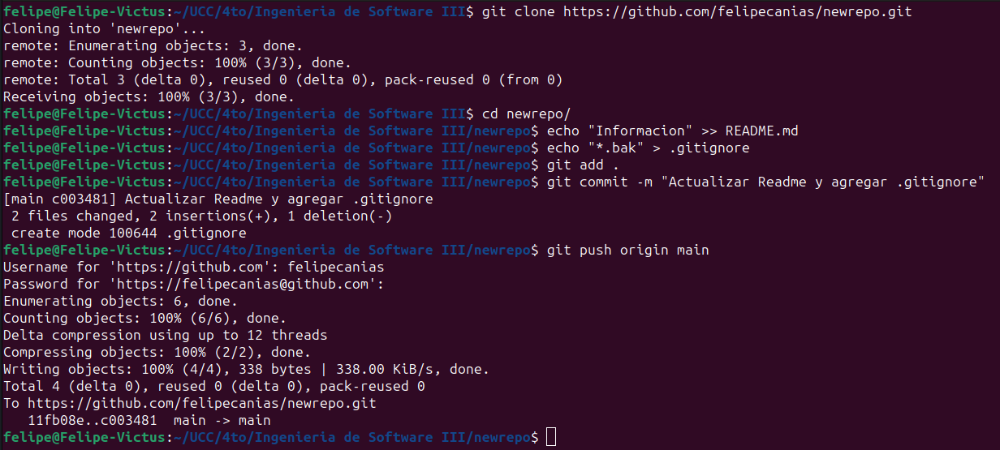
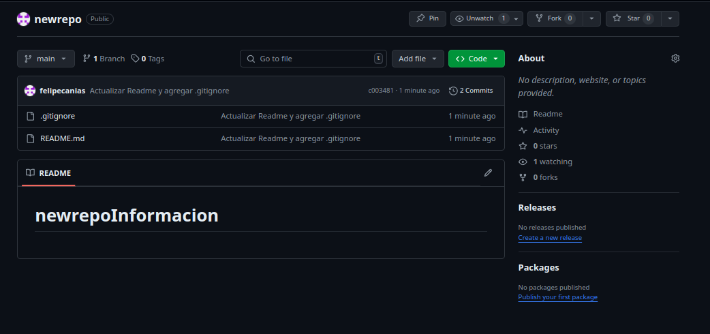

## 5. Creación de Repos 02 -> Crearlo localmente y subirlo a GitHub

 1. Crear un repositorio local:
```
mkdir reponew
cd reponew
git init
```

 2.Agregar archivo README.md:
```
echo "# New Repo" > README.md
```

 3.Crear repositorio en GitHub.

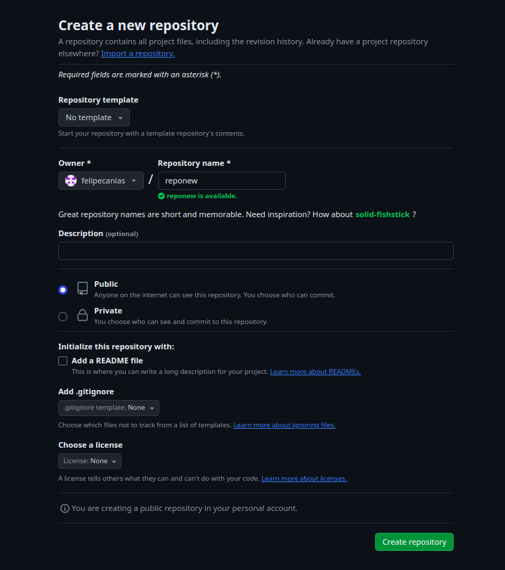

 4.Asociar repo local con remoto:
```
git remote add origin https://github.com/felipecanias/reponew.git
```

 5.Crear archivo .gitignore:
```
echo "*.bak" > .gitignore
```

 6.Hacer commit y push:
```
git add .
git commit -m "Inicializar repo"
git push -u origin main
```

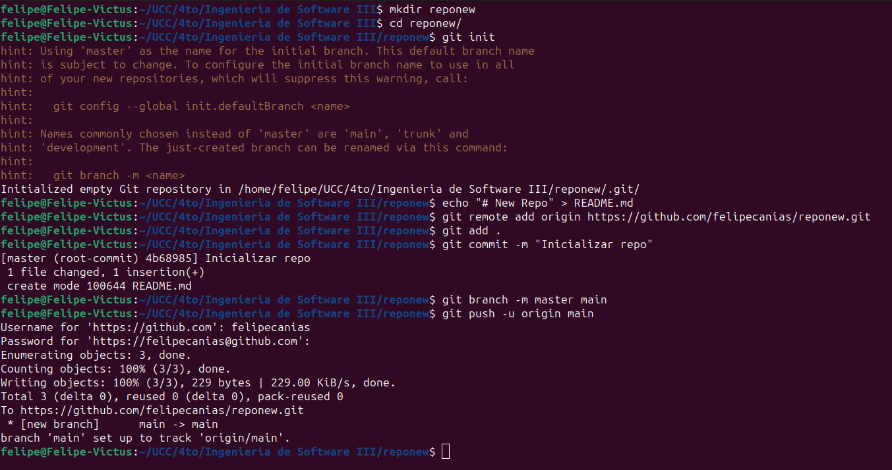

## 6. Ramas

 1.Crear una nueva rama:
```
git branch nueva_rama
```

 2.Cambiarse a esa rama:
```
git checkout nueva_rama
```

 3.Hacer un cambio en README.md y hacer commit:
```
echo "Nueva rama" >> README.md
git add .
git commit -m "Cambios en nueva rama"
```

 4.Revisar diferencias entre ramas:
```
git checkout main
git diff main nueva_rama
```

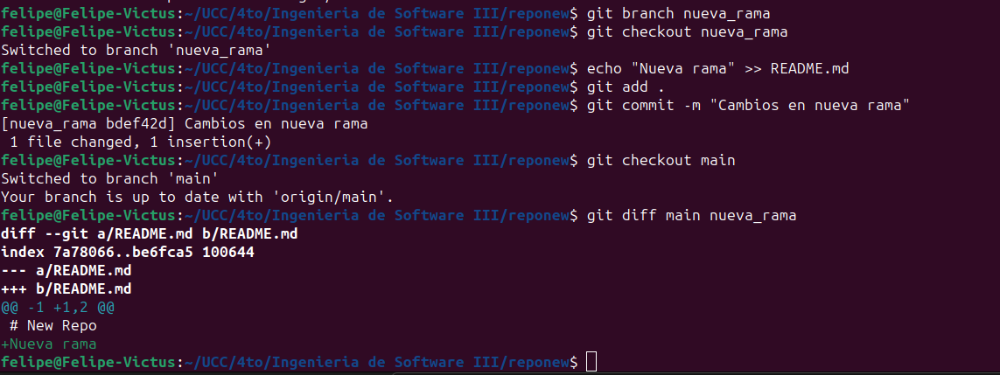

## 7. Merges

 1.Hacer un merge FF (fast-forward):
```
git merge nueva_rama
```

 2.Borrar la rama creada:
```
git branch -d nueva_rama
```

 3.Ver el log de commits:
```
git log
```

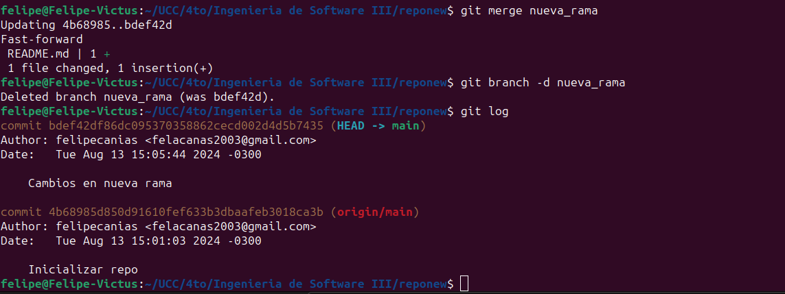

 4.Hacer un merge con No-FF:
```
git merge --no-ff nueva_rama
```


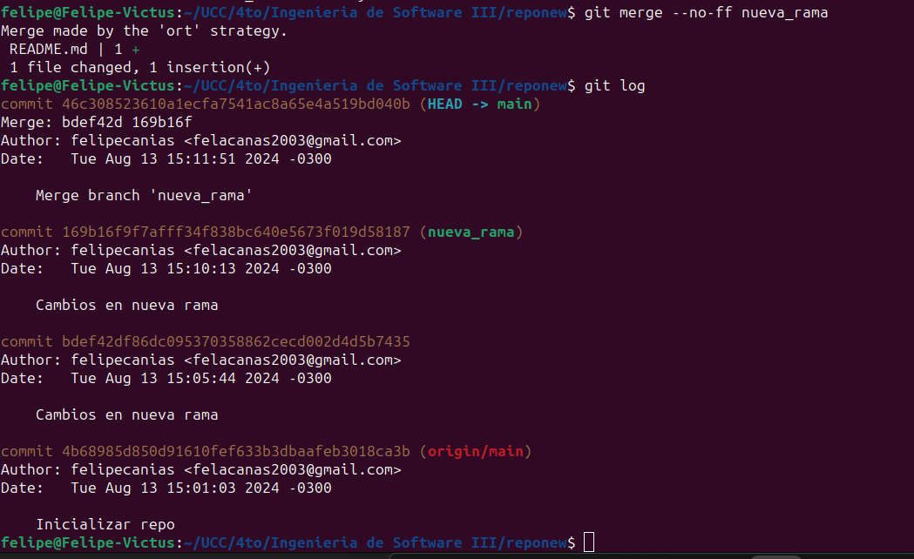

## 8. Resolución de Conflictos

 1.Configurando VSC como difftool y mergetool:
```
git config --global diff.tool vscode
git config --global difftool.vscode.cmd "code --wait --diff \$LOCAL \$REMOTE"
git config --global merge.tool vscode
git config --global mergetool.vscode.cmd "code --wait \$MERGED"
```

 2.Crear conflictBranch:
```
git branch conflictBranch
```

 3.Modificar README.md desde main y commitear:
```
echo "Cambio desde main" >> README.md
git add README.md
git commit -m "Modificar Readme desde main"
```

 4.Modificar la misma línea desde conflictBranch y commitear:
```
git checkout conflictBranch
echo "Cambio desde conflictBranch" >> README.md
git add README.md
git commit -m "Modificar Readme desde conflictBranch"
```

 5.Ver diferencias:
```
git difftool main conflictBranch
```
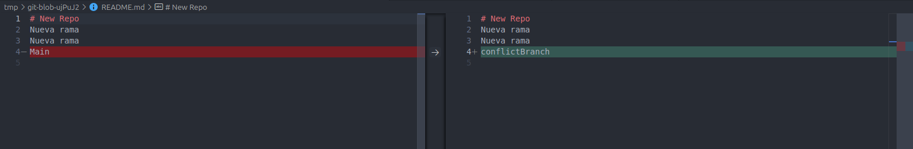

 6.Intentar mergear y resolver conflicto:
```
git checkout main
git merge conflictBranch
git mergetool
```

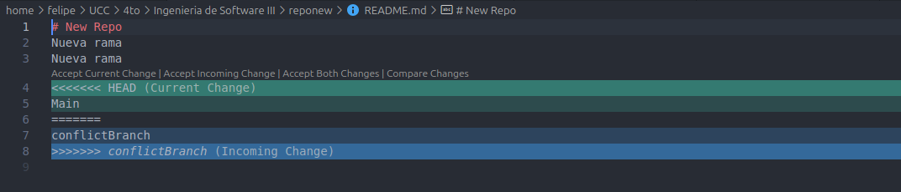
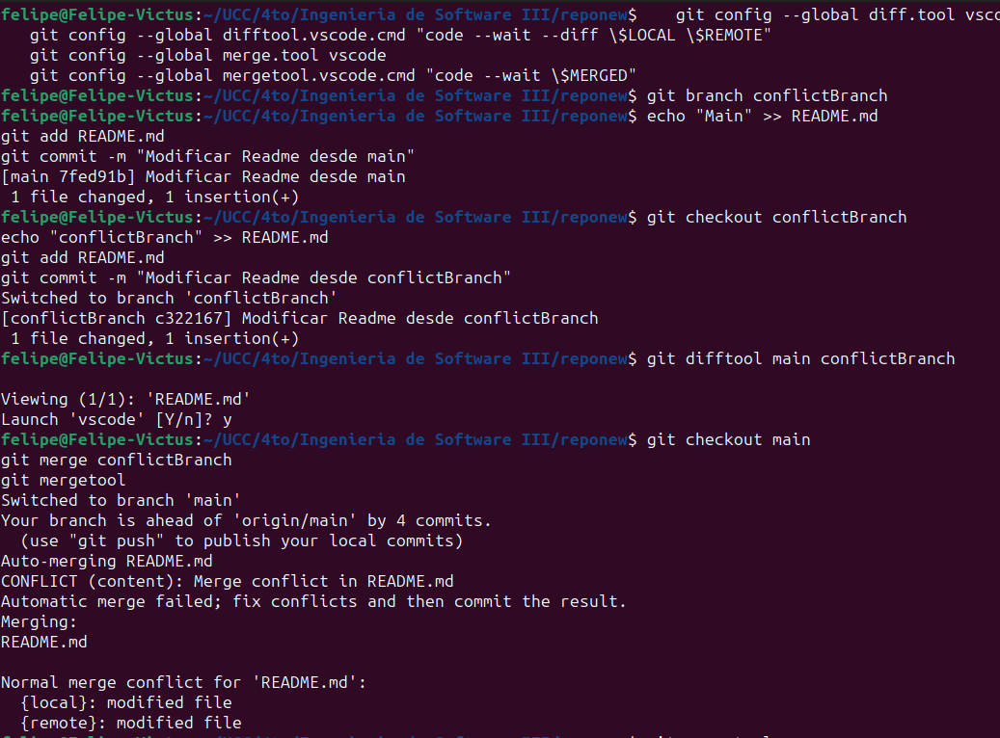

 7.Agregar .gitignore y hacer un push:
```
echo ".orig" >> .gitignore
git commit -m ".orig agragado a gitignore"
git push
```

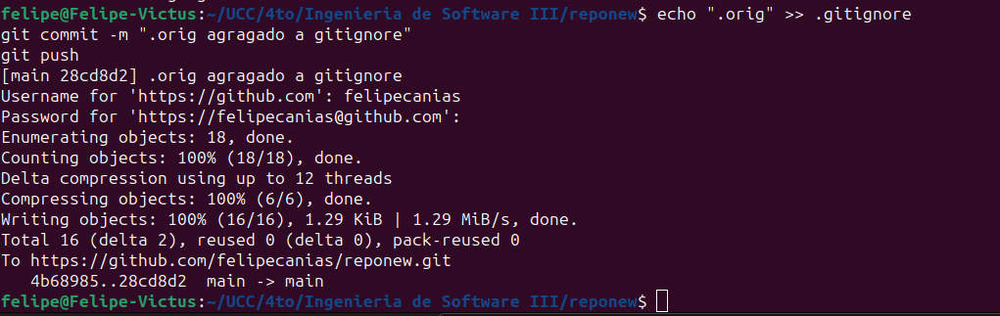

## 9. Familiarizarse con el concepto de Pull Request
 Definicion: El término "pull request" se refiere a una solicitud para que los mantenedores de un proyecto integren (hagan un "pull" de) tus cambios en la rama principal o en otra rama específica del repositorio.

 1.Crear un branch local y agregar cambios:
```
git checkout -b pr_branch
echo "Cambios en pr_branch" >> README.md
git add README.md
git commit -m "Agregar cambios en pr_branch"
git push origin pr_branch
```
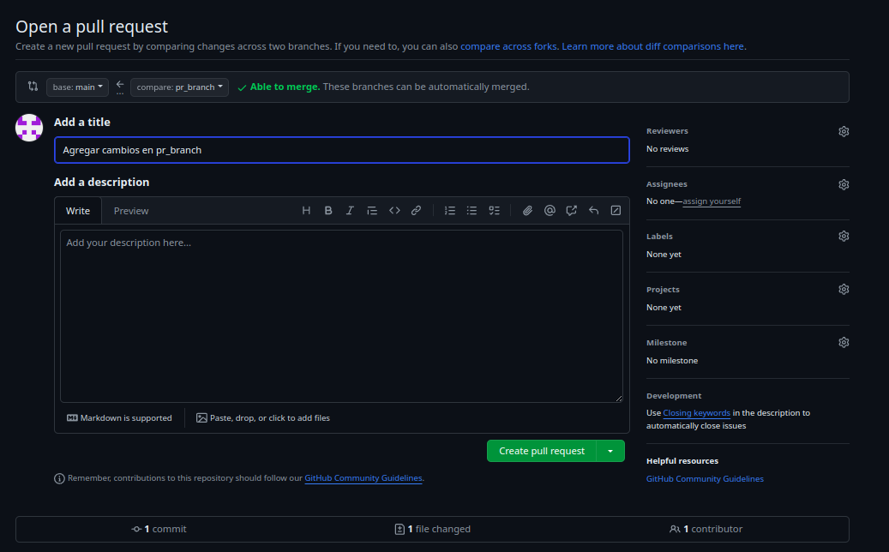
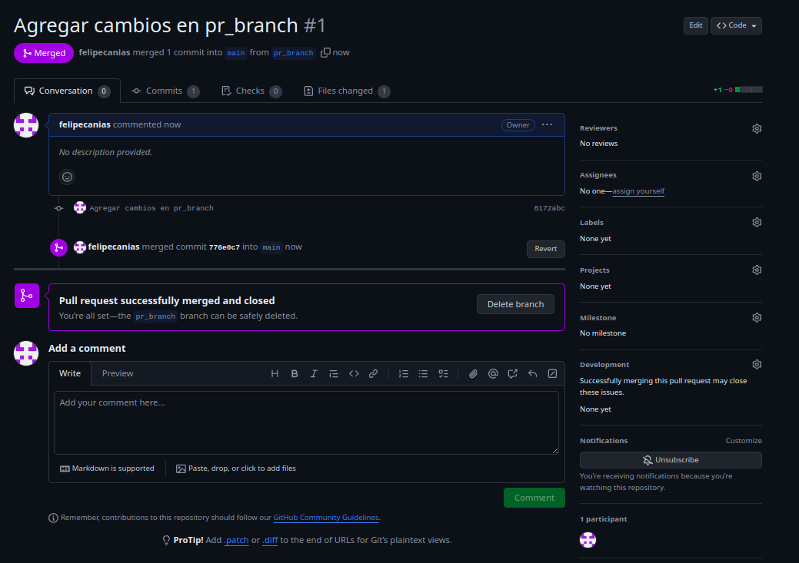

## 10. Algunos ejercicios online

 1.Entrar a Learn Git Branching.
 2.Completar los ejercicios de Introduction Sequence.

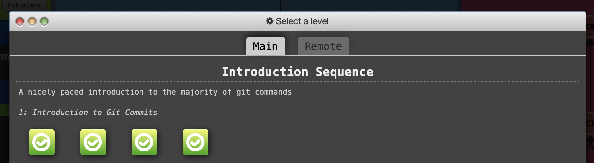


