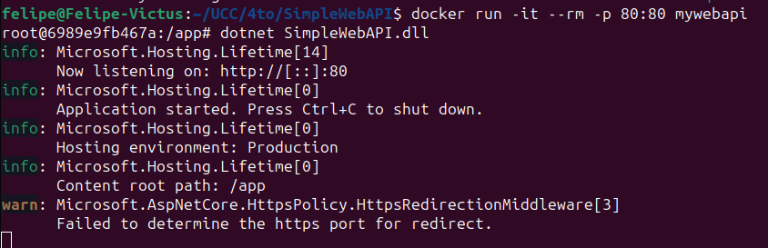

# Trabajo Practico 2 - Felipe Cañas

## 1. Instalar Docker Community Edition

```
docker version
```


## 2. Explorar DockerHub


## 3. Obtener la imagen BusyBox

Hacer pull de la imagen y chequear que se instalo correctamente:

```
docker pull busybox
docker images
```


## 4. Ejecutando contenedores

Ejecutar un contenedor utilizando el comando run de docker:

```
docker run busybox
```

Al ejecutar esto simplemente no pasara nada, ya que estaremos levantando el contenedor, pero no le indicamos que realice ninguna accion.

Por el contrario si ejecutamos lo siguiente obtendremos un resultado como respuesta:

```
docker run busybox echo "Hola Mundo"
```


Ver los contenedores ejecutados utilizando el comando ps:

```
docker ps
```

Al agregar la flag "-a" muestra todos los contenedores, no solo los que se encuentran en ejecucion:

```
docker ps -a
```


## 5. Ejecutando en modo interactivo

Entramos en modo interactivo:

```
docker run -it busybox sh
```

Ejecutar los siguientes comandos y salir del modo interactivo:
```
ps
uptime
free
ls -l /
exit
```


## 6. Borrando contenedores terminados

Obtener la lista de contenedores

```
docker ps -a
```

Borrar un contenedor especifico por su nombre, en este caso cranky_germain:
```
docker rm cranky_germain
```


Para borrar todos los contenedores que no estén corriendo, ejecutar cualquiera de los siguientes comandos:
```
docker rm $(docker ps -a -q -f status=exited)
docker container prune
```

Yo no borre todos los contenedores por que algunos los uso para el trabajo.

## 7. Construir una imagen

Descripcion de conceptos:

- FROM: Define la imagen base a partir de la cual se construye la nueva imagen Docker.

- RUN: Ejecuta comandos durante la construcción de la imagen.

- ADD: Copia archivos/directorios en la imagen, con opción de descomprimir archivos.

- COPY: Copia archivos/directorios en la imagen sin descomprimir.

- EXPOSE: Documenta el puerto que la aplicación dentro del contenedor usará.

- CMD: Especifica el comando predeterminado a ejecutar cuando el contenedor se inicia.

- ENTRYPOINT: Define un comando que siempre se ejecuta como punto de entrada del contenedor.

Clonamos el repositorio SimpleWebAPI.

```
git clone https://github.com/ingsoft3ucc/SimpleWebAPI.git
```

Explicacion de cada linea del Dockerfile:

```
# Usa la imagen oficial de ASP.NET Core 7.0 como base para la aplicación
FROM mcr.microsoft.com/dotnet/aspnet:7.0 AS base

# Establece el directorio de trabajo dentro del contenedor en /app
WORKDIR /app

# Expone el puerto 80 para HTTP
EXPOSE 80

# Expone el puerto 443 para HTTPS
EXPOSE 443

# Expone el puerto 5254 (puerto adicional que la aplicación podría usar)
EXPOSE 5254

# Usa la imagen oficial de .NET SDK 7.0 para construir la aplicación
FROM mcr.microsoft.com/dotnet/sdk:7.0 AS build

# Establece el directorio de trabajo dentro del contenedor en /src
WORKDIR /src

# Copia el archivo de proyecto (.csproj) a la carpeta SimpleWebAPI dentro del contenedor
COPY ["SimpleWebAPI/SimpleWebAPI.csproj", "SimpleWebAPI/"]

# Restaura las dependencias definidas en el archivo .csproj
RUN dotnet restore "SimpleWebAPI/SimpleWebAPI.csproj"

# Copia todos los archivos del contexto de construcción actual al contenedor
COPY . .

# Cambia el directorio de trabajo al proyecto dentro del contenedor
WORKDIR "/src/SimpleWebAPI"

# Compila el proyecto en modo Release y coloca los archivos compilados en /app/build
RUN dotnet build "SimpleWebAPI.csproj" -c Release -o /app/build

# Usa la etapa de construcción anterior para publicar la aplicación
FROM build AS publish

# Publica la aplicación en modo Release, colocando los archivos resultantes en /app/publish
RUN dotnet publish "SimpleWebAPI.csproj" -c Release -o /app/publish /p:UseAppHost=false

# Usa la imagen base para la etapa final de la construcción de la imagen
FROM base AS final

# Establece el directorio de trabajo en /app dentro del contenedor final
WORKDIR /app

# Copia los archivos publicados desde la etapa 'publish' al directorio de trabajo del contenedor final
COPY --from=publish /app/publish .

# Define el comando que se ejecutará al iniciar el contenedor, ejecutando la aplicación .NET
ENTRYPOINT ["dotnet", "SimpleWebAPI.dll"]

```

Construimos la imagen

```
docker build -t mywebapi .
```

Subimos la imagen a Docker Hub y verificamos q se subio correctamente:

```
docker login
docker tag mywebapi felipecanias/mywebapii:latest
docker push felipecanias/mywebapii:latest
docker pull felipecanias/mywebapii:latest
```


## 8. Publicando puertos
Para ejecutar un contenedor de nuestra imagen y exponer puertos para acceso externo, utilizamos:

docker run --name myapi -d -p 80:80 mywebapi


## 9. Modificar Dockerfile para soportar bash
Modificamos dockerfile para que entre en bash sin ejecutar automaticamente la app:

```
#ENTRYPOINT ["dotnet", "SimpleWebAPI.dll"]
CMD ["/bin/bash"]
```

Rehacemos la imagen:

```
docker build -t mywebapi .
```

Corremos contenedor en modo interactivo exponiendo puerto:

```
docker run -it --rm -p 80:80 mywebapi
```

Luego ejecutamos la app:



## 10. Montando volúmenes
Montar un volumen permite compartir directorios entre el host y el contenedor. Para hacerlo, ejecuta el siguiente comando:
```
docker run -it --rm -p 80:80 -v ./.temp:/var/temp mywebapi
```

Dentro del contenedor, puedes comprobar el contenido del volumen montado con los siguientes comandos:
```
ls -l /var/temp
touch /var/temp/hola.txt
```

Estos pasos permiten crear y verificar archivos en el volumen compartido, demostrando cómo el contenedor puede interactuar directamente con el sistema de archivos del host.


## 11. Utilizando una base de datos

Levantar una base de datos PostgreSQL:
```
mkdir $HOME/.postgres
docker run --name my-postgres -e POSTGRES_PASSWORD=mysecretpassword -v $HOME/.postgres:/var/lib/postgresql/data -p 5432:5432 -d postgres:9.4
```

Nos conectamos al contenedor para ejecutar comandos SQL:
```
docker exec -it my-postgres /bin/bash
psql -h localhost -U postgres
```

Dentro de PostgreSQL, podemos crear y manipular bases de datos y tablas.
```
\l
create database test;
\connect test
create table tabla_a (mensaje varchar(50));
insert into tabla_a (mensaje) values('Hola mundo!');
select * from tabla_a;
\q
```


DBeaver:


`docker run:` se usa para crear y lanzar un nuevo contenedor basado en una imagen especificada. En el caso del ejercicio, docker run se utilizó para arrancar un contenedor de PostgreSQL, configurado para que la base de datos esté accesible en el puerto 5432. Además, se habilitó la persistencia de datos mediante volúmenes, lo que asegura que los datos almacenados se mantengan incluso si el contenedor se detiene. Este comando también permite establecer variables de entorno, como la contraseña para el usuario postgres, asegurando que la configuración del contenedor sea la adecuada desde su inicio.

`docker exec:` se emplea para ejecutar comandos dentro de un contenedor que ya está en funcionamiento. En este contexto, docker exec se utilizó para abrir una sesión interactiva en el contenedor de PostgreSQL, permitiendo ejecutar comandos directamente en la instancia de la base de datos que se está ejecutando dentro del contenedor. Esto facilita la administración de la base de datos, la realización de consultas y la ejecución de otras tareas de mantenimiento, todo directamente desde el entorno del contenedor en ejecución.

## 12. Hacer el punto 11 con Microsoft SQL Server

Levantar una base de datos Microsoft SQL:
```
mkdir -p $HOME/.mssql
docker run --name my-mssql -e 'ACCEPT_EULA=Y' -e 'SA_PASSWORD=StrongP@ssw0rd!' -v $HOME/.mssql:/var/opt/mssql -p 1433:1433 -d mcr.microsoft.com/mssql/server:2019-latest
```

Nos conectamos al contenedor para ejecutar comandos SQL:
```
docker exec -it my-mssql /opt/mssql-tools/bin/sqlcmd -S localhost -U SA -P 'StrongP@ssw0rd!'
```


