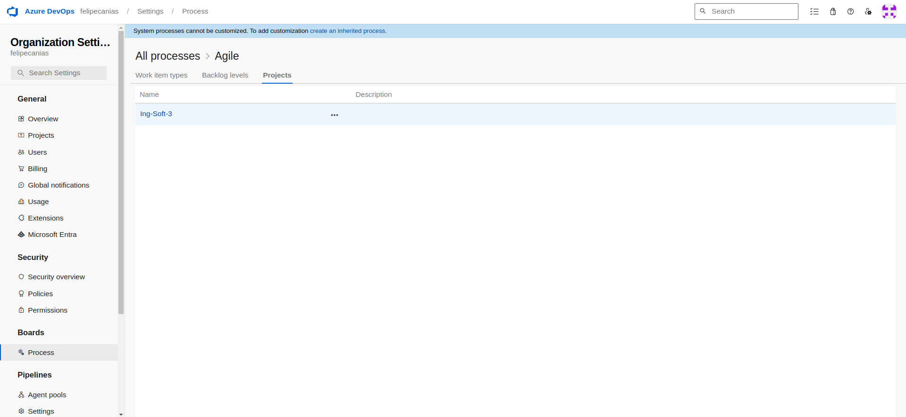
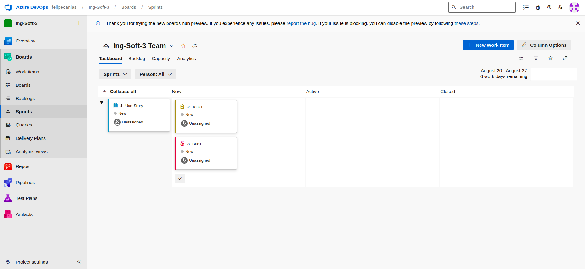

# Trabajo Practico 3 - Felipe Cañas

## 3- Pasos del TP

### 3.1 Crear una cuenta en Azure DevOps

### 3.2 Crear un proyecto Sample01

### 3.3 Crear un repo GIT desde cero

### 3.4 Crear un proyecto Sample02

### 3.5 Importar un repo desde GitHub: https://github.com/ingsoft3ucc/SimpleWebAPI.git

### 3.6 Realizar un cambio en un archivo, y subirlo al repo de ADO.

### 3.7 Crear un pipeline, solicitar acceso a jobs de paralelismo

### 3.8 Cambiar el tipo de proceso de Basic a Agile

### 3.8 Crear un sprint

### 3.9 Crear User Stories

### 3.10 Crear Tasks y Bugs

