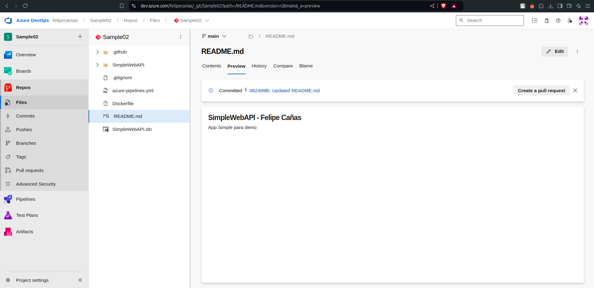

# Trabajo Practico 4 - Felipe Cañas

## 4- Pasos del TP

## 4.1 Verificar acceso a Pipelines concedido

## 4.2 Agregar en pipeline YAML una tarea de Publish.

## 4.3 Explicar por qué es necesario contar con una tarea de Publish en un pipeline que corre en un agente de Microsoft en la nube.

Es necesario tener una tarea de Publish en un pipeline de un agente de Microsoft en la nube para subir artefactos generados durante el proceso de build o pruebas a un almacenamiento central. Esto permite compartir y reutilizar estos artefactos en diferentes etapas del pipeline o en otros pipelines.

## 4.4 Descargar el resultado del pipeline y correr localmente el software compilado.

## 4.5 Habilitar el editor clásico de pipelines. Explicar las diferencias claves entre este tipo de editor y el editor YAML.

**Editor clásico de pipelines:** es una interfaz gráfica que permite crear y configurar pipelines mediante formularios y opciones predefinidas, lo que facilita la configuración sin necesidad de escribir código.

**Editor YAML:** usa un archivo de texto en formato YAML para definir pipelines, proporcionando una mayor flexibilidad y control, pero requiere conocimiento de sintaxis YAML y un enfoque más detallado para la configuración.

En resumen, el editor clásico es más accesible para usuarios que prefieren una interfaz gráfica, mientras que el editor YAML ofrece mayor personalización y control detallado a través de código.

## 4.6 Crear un nuevo pipeline con el editor clásico. Descargar el resultado del pipeline y correr localmente el software compilado.

## 4.7 Configurar CI en ambos pipelines (YAML y Classic Editor). Mostrar resultados de la ejecución automática de ambos pipelines al hacer un commit en la rama main.

## 4.8 Explicar la diferencia entre un agente MS y un agente Self-Hosted. Qué ventajas y desventajas hay entre ambos? Cuándo es conveniente y/o necesario usar un Self-Hosted Agent?

* **Agente MS (Managed Service Agent)**:

    * Ubicación: En la nube, gestionado por Microsoft.
    * Ventajas: Configuración fácil, actualizaciones automáticas, escalabilidad.
    * Desventajas: Recursos compartidos, menos control sobre el entorno, costos elevados en proyectos grandes.

* **Agente Self-Hosted**:

    * Ubicación: En tu infraestructura propia.
    * Ventajas: Control total, recursos dedicados, configuración personalizada.
    * Desventajas: Mantenimiento a tu cargo.

* **Uso conveniente de Self-Hosted**:

    * Requisitos específicos de software.
    * Necesidad de recursos dedicados.
    * Configuración o seguridad personalizada.

## 4.8 Crear un Pool de Agentes y un Agente Self-Hosted

## 4.9 Instalar y correr un agente en nuestra máquina local.

## 4.10 Crear un pipeline que use el agente Self-Hosted alojado en nuestra máquina local.

## 4.11 Buscar el resultado del pipeline y correr localmente el software compilado.

## 4.12 Crear un nuevo proyecto en ADO clonado desde un repo que contenga una aplicación en Angular como por ejemplo https://github.com/ingsoft3ucc/angular-demo-project.git

## 4.13 Configurar un pipeline de build para un proyecto de tipo Angular como el clonado.

## 4.14 Habilitar CI para el pipeline.

## 4.15 Hacer un cambio a un archivo del proyecto (algún cambio en el HTML que se renderiza por ejemplo) y verificar que se ejecute automáticamente el pipeline.

## 4.16 Descargar el resultado del pipeline y correr en un servidor web local el sitio construido.

## 4.17 Mostrar el antes y el después del cambio.
**ANTES:**

**DESPUES:**
