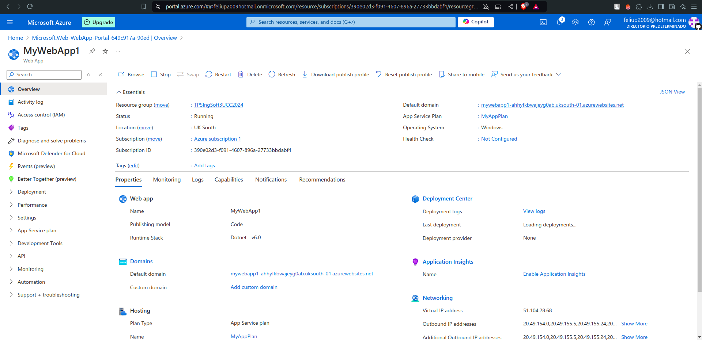
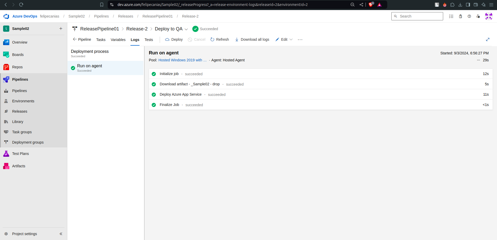
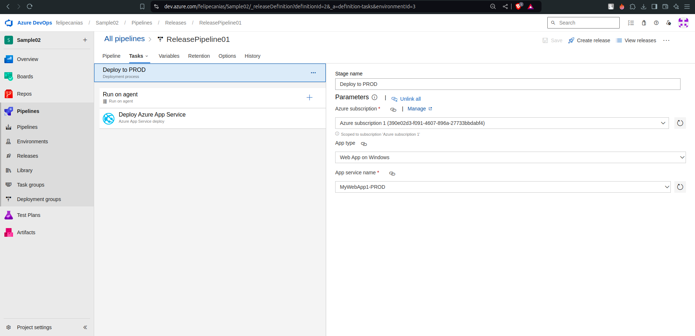
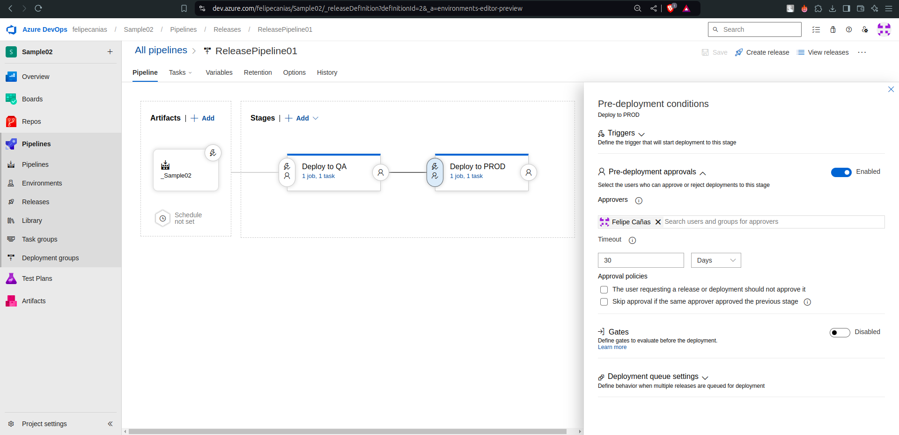
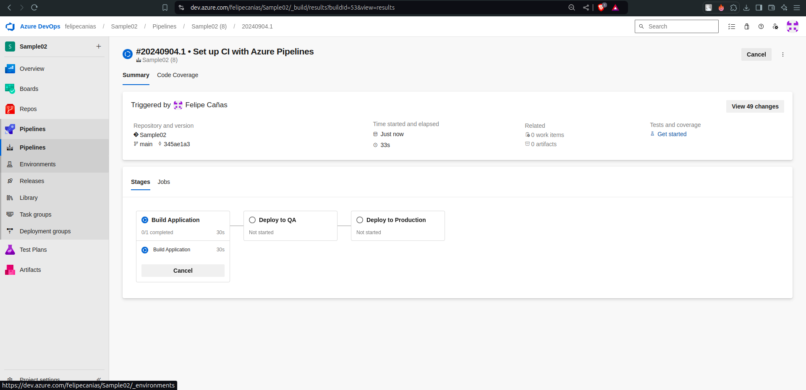
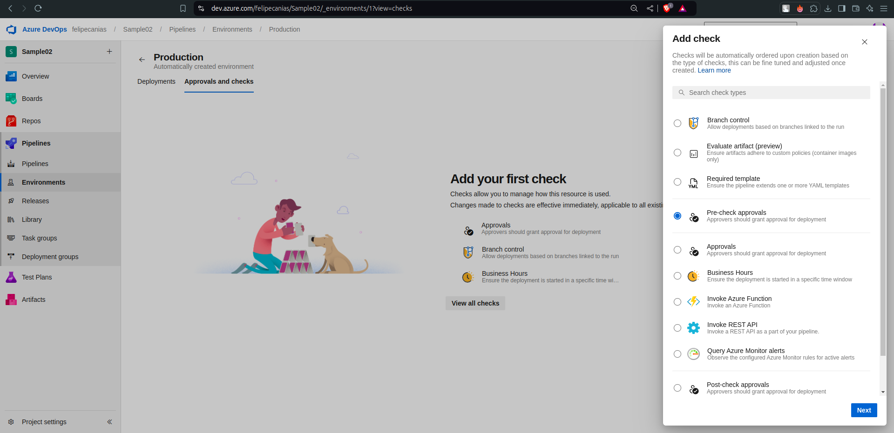

# Trabajo Practico 5 - Felipe Cañas

## 4- Pasos del TP

## 4.1. Crear una cuenta en Azure


## 4.2. Crear un recurso Web App en Azure Portal y navegar a la url provista


 




## 4.3. Actualizar Pipeline de Build para que use tareas de DotNetCoreCLI@2 como en el pipeline clásico, luego crear un Pipeline de Release en Azure DevOps con CD habilitada




## 4.4. Optimizar Pipeline de Build

El pipiline de build se encuentra optimizado en el .yml del punto anterior.

## 4.5. Verificar el deploy en la url de la WebApp /weatherforecast


## 4.6. Realizar un cambio al código del controlador para que devuelva 7 pronósticos, realizar commit, evaluar ejecución de pipelines de build y release, navegar a la url de la webapp/weatherforecast y corroborar cambio


## 4.7. Clonar la Web App de QA para que contar con una WebApp de PROD a partir de un Template Deployment en Azure Portal y navegar a la url provista para la WebApp de PROD.


## 4.8. Agregar una etapa de Deploy a Prod en Azure Release Pipelines




## 4.9. Realizar un cambio al código del controlador para que devuelva 10 pronósticos, realizar commit, evaluar ejecución de pipelines de build y release, navegar a la url de la webapp/weatherforecast y corroborar cambio, verificar que en la url de la webapp_prod/weatherforecast se muestra lo mismo.


**WEBAPP:**


**WEBAPP-PROD:**


## 4.10. Modificar pipeline de release para colocar una aprobación manual para el paso a Producción.



## 4.11. Realizar un cambio al código del controlador para que devuelva 5 pronósticos, realizar commit, evaluar ejecución de pipelines de build y release, navegar a la url de la webapp/weatherforecast y corroborar cambio, verificar que en la url de la webapp_prod/weatherforecast aun se muestra la versión anterior.


**WEBAPP:**


**WEBAPP-PROD:**


## 4.12. Aprobar el pase ya sea desde el release o desde el mail recibido.


## 4.13. Esperar a la finalización de la etapa de Pase a Prod y luego corroborar que en la url de la webapp_prod/weatherforecast se muestra la nueva versión coinicidente con la de QA.


## 4.14. Realizar un pipeline (no release) que incluya el deploy a QA y a PROD con una aprobación manual. El pipeline debe estar construido en YAML sin utilizar el editor clásico de pipelines ni el editor clásico de pipelines de release.

Creamos el pipeline, posteriormente damos permisos al usuario Felipe Cañas para realiazar aprovasiones desde el Enviroment. Por ultimo aprovamos el "Deploy to Production".







**WEBAPP:**


**WEBAPP-PROD:**


**Yaml:**

```
trigger:
- main

pool:
  vmImage: 'ubuntu-latest'

variables:
  solution: 'SimpleWebAPI.sln'
  buildPlatform: 'Any CPU'
  buildConfiguration: 'Release'
  ConnectedServiceName: 'Azure subscription 1 (390e02d3-f091-4607-896a-27733bbdabf4)' # Subscription ID
  WebAppKind: 'webApp'
  DevWebAppName: 'MyWebApp1' # QA WebApp name
  ProdWebAppName: 'MyWebApp1-PROD' # Production WebApp name

stages:
- stage: Build
  displayName: 'Build Application'
  jobs:
  - job: Build
    displayName: 'Build Application'
    steps:
      - task: UseDotNet@2
        inputs:
          packageType: sdk
          version: '8.x'  # Use the correct version of .NET
          installationPath: $(Agent.ToolsDirectory)/dotnet

      - script: |
          echo "Current directory: $(Build.SourcesDirectory)"
          cd $(Build.SourcesDirectory)
          ls -l
          dotnet restore $(solution)
        displayName: 'Restore NuGet Packages'

      - script: |
          dotnet build $(solution) --configuration $(buildConfiguration)
        displayName: 'Build Project'

      - script: |
          dotnet test $(solution) --configuration $(buildConfiguration)
        displayName: 'Run Unit Tests'

      - script: |
          dotnet publish $(solution) --configuration $(buildConfiguration) --output $(Build.ArtifactStagingDirectory) --no-build
        displayName: 'Publish Project'
      
      - task: PublishBuildArtifacts@1
        inputs:
          pathToPublish: '$(Build.ArtifactStagingDirectory)'
          artifactName: 'drop'
          publishLocation: 'Container'
        displayName: 'Publish Build Artifacts'

- stage: DeployToQA
  displayName: 'Deploy to QA'
  dependsOn: Build
  condition: succeeded()
  jobs:
  - job: DeployToQA
    displayName: 'Deploy to QA'
    steps:
      - task: DownloadPipelineArtifact@2
        displayName: 'Download Build Artifacts'
        inputs:
          buildType: 'current'
          artifactName: 'drop'
          targetPath: '$(Pipeline.Workspace)/drop'

      - script: ls -l "$(Pipeline.Workspace)/drop"
        displayName: 'List Pipeline Workspace Content (QA)'

      - task: AzureRmWebAppDeployment@4
        displayName: 'Deploy to Azure App Service (QA)'
        inputs:
          azureSubscription: '$(ConnectedServiceName)'
          appType: 'webApp'
          WebAppName: '$(DevWebAppName)'
          package: '$(Pipeline.Workspace)/drop'

- stage: DeployToProd
  displayName: 'Deploy to Production'
  dependsOn: DeployToQA
  condition: succeeded()
  jobs:
  - deployment: DeployToProd
    displayName: 'Deploy to Production'
    environment: 'Production'
    strategy:
      runOnce:
        deploy:
          steps:
            - task: DownloadPipelineArtifact@2
              displayName: 'Download Build Artifacts'
              inputs:
                buildType: 'current'
                artifactName: 'drop'
                targetPath: '$(Pipeline.Workspace)/drop'

            - script: ls -l "$(Pipeline.Workspace)/drop"
              displayName: 'List Pipeline Workspace Content (Production)'

            - task: AzureRmWebAppDeployment@4
              displayName: 'Deploy to Azure App Service (Production)'
              inputs:
                azureSubscription: '$(ConnectedServiceName)'
                appType: 'webApp'
                WebAppName: '$(ProdWebAppName)'
                package: '$(Pipeline.Workspace)/drop'
```