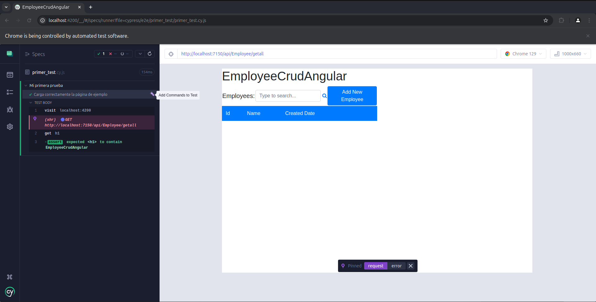
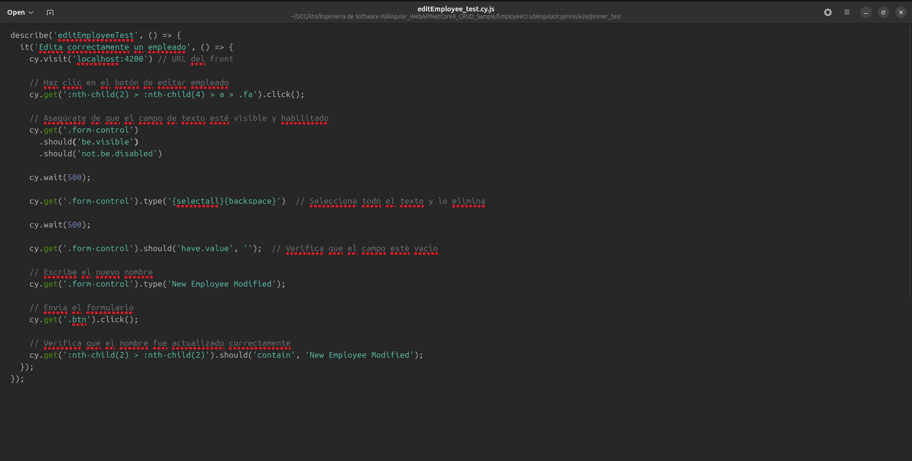
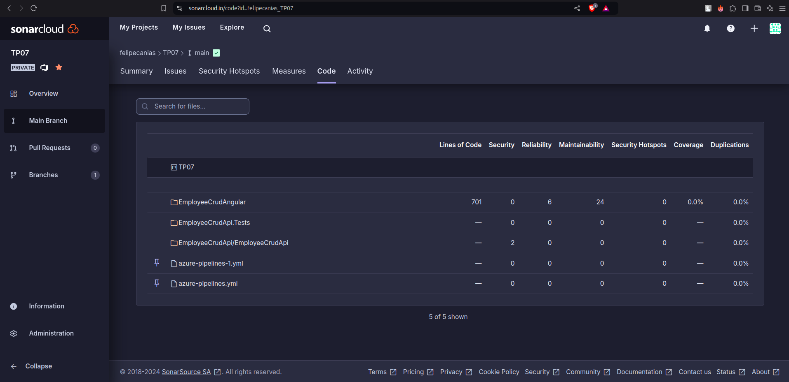

## Trabajo Práctico 7 - Code Coverage, Análisis estático de Código y Pruebas de Integración

## Felipe Cañas

### Desarrollo:

#### Prerequisitos:

#### 4.1 Agregar Code Coverage a nuestras pruebas unitarias de backend y front-end e integrarlas junto con sus resultados en nuestro pipeline de build.

##### 4.1.1 En el directorio raiz de nuestro proyecto Angular instalar el siguiente paquete:

##### 4.1.2 Editar nuestro archivo karma.conf.js para que incluya reporte de cobertura

##### 4.1.3 En el dir raiz del proyecto EmployeeCrudApi.Tests ejecutar:

##### 4.1.4 Agregar a nuestro pipeline ANTES del Build de Back la tarea de test con los argumentos especificados y la de publicación de resultados de cobertura:

##### 4.1.5 Agregar a nuestro pipeline ANTES del Build de front la tarea de test y la de publicación de los resultados.

##### 4.1.6 Ejecutar el pipeline y analizar el resultado de las pruebas unitarias y la cobertura de código.

#### 4.2 Agregar Análisis Estático de Código con SonarCloud:

##### 4.2.1 Integraremos SonarCloud para analizar el código fuente. Configurar SonarCloud en nuestro pipeline siguiendo instructivo 5.1

- Antes de nuestra tarea de Build del Back:

- Despues de nuestra tarea de Build del Back:

##### 4.2.2 Vemos el resultado de nuestro pipeline, en extensions tenemos un link al análisis realizado por SonarCloud

##### 4.2.3 Ir al link y analizar toda la información obtenida. Detallar en la entrega del TP los puntos más relevantes del informe, qué significan y para qué sirven.

### Análisis de SonarCloud
Total de issues: 9 

High severity issues: 3

Tipo: Code Smells y Vulnerability.

Tiempo de esfuerzo: 47 min de esfuerzo

#### Puntos relevantes (High Severity):
 - Vulnerability:
  Contraseña de la base de datos esta expuesta en el archivo 'appsettings.json'.
  Solución: Cambiar y eliminar la contraseña del código.

 - Code Smells:
    Propiedades de valor deben ser anulables o requeridas en Employee.cs.
    Solución: Usar nullable o JsonRequired.

#### 4.3 Pruebas de Integración con Cypress:

##### 4.3.1 En el directorio raiz de nuestro proyecto Angular instalar el siguiente paquete:

##### 4.3.2 Abrir Cypress:

##### 4.3.3 Inicializar Cypress en nuestro proyecto como se indica en el instructivo 5.2

##### 4.3.4 Crear nuestra primera prueba navegando a nuestro front.

##### 4.3.5 Correr nuestra primera prueba

##### 4.3.6 Modificar nuestra prueba para que falle.

Editamos el archivo primer_test.cy.js y hacemos que espere otra cosa en el título

Ejecutamos cypress en modo headless

Screenshot tomada por Cypress: 

##### 4.3.6 Grabar nuestras pruebas para que Cypress genere código automático y genere reportes:

- Cerramos Cypress

- Editamos el archivo cypress.config.ts incluyendo la propiedad **experimentalStudio** en true y la configuración de reportería.

- Corremos nuevamente Cypress con npx cypress open, una vez que se ejecute nuestra prueba tendremos la opción de "Add Commands to Test". Esto permitirá interactuar con la aplicación y generar automáticamente comandos de prueba basados en las interacciones con la página:

- Por ejemplo, si agregamos un nuevo empleado y luego verificamos que esté en la lista, Cypress nos generará un código como este:

- Por supuesto que habrá que hacerle ajustes, como por ejemplo que se fije siempre en la última fila de la grilla y no en la posición 15 como lo grabó, es ahí cuando consultando la documentación de Cypress debemos ver cómo modificar el código, en nuestro caso de ejemplo sería así:

##### 4.3.7 Hacemos prueba de editar un empleado

- Creamos en cypress/e2e/ un archivo editEmployee_test.cy.js con el siguiente contenido, guardamos y aparecerá en Cypress:

- Hacemos "Add command to the test" y empezamos a interactuar con la página

- Hacemos algunos ajustes al código generado:

#### 4.4 Desafíos:

- Integrar en el pipeline SonarCloud para nuestro proyecto Angular, mostrar el resultado obtenido en SonarCloud

- Implementar en Cypress pruebas de integración que incluya los casos desarrollados como pruebas unitarias del front en el TP06.

- Incorporar al pipeline de Deploy la ejecución de las pruebas de integración y la visualización de sus resultados.

- **Resultado esperado**:

  - Un Pipeline en YAML que incluya a) Build de QA y Front con ejecución y resultado de pruebas de code coverage, pruebas unitarias y análisis de Sonar Cloud y b) Deploy a WebApp(s) de QA y Front que incluya ejecución y resultado de pruebas de integración

  - Dos Stages: Una para Build, Test Unitarios, Code Coverage y SonarCloud y otra para el Deploy a QA con Tests de Integración

  - En la pestaña Test, poder visualizar los Test Unitarios de Front y Back y los Test de Integracion:

  - En la pestaña Code Coverage, visualizar la cobertura de las pruebas unitarias de Back y de Front:

  - En la pestaña Extensions, ver el análisis de SonarCloud en verde

  - Un documento de una carilla explicando qué información pudieron sacar del análisis de Sonar Cloud y de las pruebas de cobertura.

### Informe de Análisis de SonarCloud y Cobertura de Código

#### Cobertura de Código

  El análisis de cobertura de código muestra una cobertura global del 63.06%. Esto indica que casi dos tercios del código están cubiertos por pruebas unitarias, dejando un 36.94% del código sin cubrir, lo que representa posibles áreas de riesgo no evaluadas. A continuación, se destacan los resultados de cobertura por módulo:

 - EmployeeController.cs: Cobertura del 95.45% (42 líneas cubiertas de un total de 44). Este resultado sugiere que la mayoría de las funcionalidades del controlador están bien probadas, con solo un pequeño porcentaje sin evaluar.
 - ApplicationDbContext.cs: Cobertura completa del 100% (4 de 4 líneas cubiertas), asegurando que todos los métodos relevantes para el acceso a datos están probados.
 - Employee.cs: Cobertura completa del 100% (3 de 3 líneas cubiertas).
 - Program.cs: Cobertura del 0%. Ninguna de las 24 líneas está cubierta por pruebas, lo que podría ser crítico, ya que este archivo es el punto de entrada de la aplicación y maneja configuraciones importantes.
 - addemployee.component.ts: Presenta una cobertura del 75.61% (31 de 41 líneas cubiertas). La mayoría de la lógica del componente está probada, pero aún queda una parte significativa sin validar.
 - app.component.ts y environment.ts: Ambos archivos tienen una cobertura completa del 100%.
 - employee.model.ts: Cobertura del 100% (3 de 3 líneas), asegurando que todos los modelos de datos están verificados.
 - employee.service.ts: Cobertura del 61.54% (8 de 13 líneas cubiertas). Sería recomendable incrementar la cobertura en este archivo debido a su importancia en la gestión de datos.
 - employee.component.ts: Cobertura baja del 22.73% (5 de 22 líneas cubiertas), lo que indica que la mayoría de las funcionalidades no están probadas, representando un área de riesgo importante.

#### Hallazgos de SonarCloud

El análisis de SonarCloud identificó varias áreas de mejora en términos de calidad del código y posibles riesgos. Se pueden clasificar de la siguiente manera:

##### Seguridad (Vulnerabilidades)

 - appsettings.json: Se detectaron contraseñas de base de datos en el archivo de configuración (appsettings.json) en el backend. Estas credenciales están expuestas directamente en el código, lo cual es un riesgo crítico (blocker). Se recomienda eliminarlas y gestionarlas mediante variables de entorno o servicios de almacenamiento seguro.

 - Copias en directorios de compilación: Se encontró la misma vulnerabilidad en un archivo de configuración ubicado en una carpeta de compilación (bin/Debug/net8.0/appsettings.json). Esto sugiere que las credenciales están incluidas también en el paquete de compilación, lo cual representa un riesgo de seguridad significativo.

##### Mantenibilidad (Code Smells)

 - addemployee.component.css: Se identificó un code smell de tipo mayor por un archivo CSS vacío. Mantener archivos vacíos aumenta la complejidad y reduce la mantenibilidad del proyecto, ya que añade ruido innecesario al código.

 - addemployee.component.html: Falta de asociación entre etiquetas de formulario y controles. Es un code smell menor pero afecta la usabilidad y accesibilidad del formulario.

 - addemployee.component.html: No se ha definido el atributo alt en las imágenes. Esto afecta la accesibilidad y puede causar problemas de usabilidad para usuarios que dependen de lectores de pantalla.

### Subir a proyecto de Azure DevOps

ADO repo: https://dev.azure.com/felipecanias/TP07

### Criterio de Calificación

Los pasos 4.1 al 4.3 representan un 60% de la nota total, los pasos 4.4 y subsiguientes representan el 40% restante.